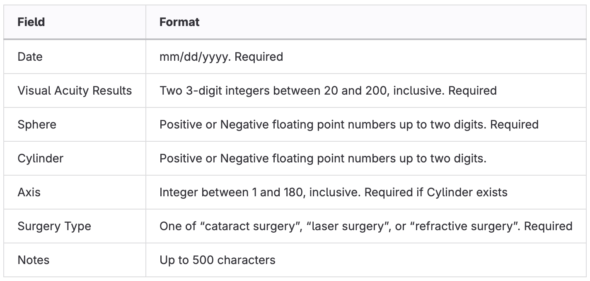

# 11.30 셀 22 정기 미팅 - UC22 플래닝

## Flow

The patient, HCP, and ophthalmologist가 documented ophthalmology surgery visit를 볼 수 있어야 합니다. - logging 부분에 HCP view가 없음 추가하는게 맞나? 아마 삭제하는게 맞는 듯 합니다.

patient는 Past Office Visits Page에서, ophthalmologist는 edit office visit page에서 view할 예정입니다.

OPH가 Document Office Visit에서 Ophthalmology Surgery를 선택하면

- Date (current date is default)
- Visual Acuity Results (left and right eye)
- Sphere (left and right eye)
- Cylinder (left and right eye)
- Axis (left and right eye)
- Surgery Type
- Notes

위의 데이터를 입력하는 matrix가 나옵니다.

그 후 matrix를 입력하고 Submit Surgery Visit버튼을 누르면 추가가 됩니다. (이때, 데이터는 아래 표의 양식을 따라야 합니다)



OPH가 edit office visit page의 Ophthalmology Surgery에서 edit을 고르면

- Date (current date is default)
- Visual Acuity Results (left and right eye)
- Sphere (left and right eye)
- Cylinder (left and right eye)
- Axis (left and right eye)
- Surgery Type
- Notes

이 데이터를 입력하는 페이지가 나옵니다.

그 후 matrix를 입력하고 Update Office Visit버튼을 누르면 Ophthalmology Surgery가 edit됩니다.

## Front

1. Past Office Visits Page가 구현되어야 합니다.
2. patient가 Past Office Visits Page에서 ophthalmology surgery로 라벨 된 visit을 고르고 view 버튼을 누르면 surgery에 대한 상세 정보를 보여줘야 합니다.
3. Edit Office Visit페이지가 구현되어야 합니다.
4. Edit Office Visit페이지의 ophthalmology surgery에서 view를 고르면 surgery에 대한 상세 정보를 보여줘야 합니다.
5. Edit Office Visit페이지의 ophthalmology surgery에서 edit을 고르면
    - Date (current date is default)
    - Visual Acuity Results (left and right eye)
    - Sphere (left and right eye)
    - Cylinder (left and right eye)
    - Axis (left and right eye)
    - Surgery Type
    - Notes

    이 데이터를 입력하는 페이지가 나와야 합니다.

6. 위의 페이지에서 Update Office Visit을 눌럿을 때, 입력된 데이커가 양식에 맞지 않으면 에러 메시지를 출력하고, 데이터 양식에 맞다면 ophthalmology surgery를 업데이트 하고 “Office visit edited successfully" 라는 메시지를 출력하고, 페이지를 닫습니다.
7. Document Office Visit페이지에서 ophthalmology surgery를 선택하면
    - Date (current date is default)
    - Visual Acuity Results (left and right eye)
    - Sphere (left and right eye)
    - Cylinder (left and right eye)
    - Axis (left and right eye)
    - Surgery Type
    - Notes

    이 데이터를 입력하는 칸이 추가로 나와야 하고, 버튼이 Submit Surgery Visit으로 변해야 합니다.

8. Submit Surgery Visit을 눌럿을 때, 입력된 데이터가 양식에 맞지 않으면 에러 메시지를 출력하고, 데이터 양식에 맞다면 ophthalmology surgery에 추가를 하고  "Office visit added successfully" 라는 메시지를 출력합니다.

## Backend

1. 새로운 데이터베이스를 구축해야 합니다.

    ```jsx
    1. id: 해당 데이터베이스의 primary key
    2. patientUsername: 환자의 username, 필수
    3. OHPUsername: OHP의 username, 필수
    4. height/Length: 키, 옵션
    5. weight: 몸무게, 옵션
    6. householdSmockingStatus: 흡연 여부, 옵션
    7. date: visit하는 날짜, 필수
    8. visualAcuityResultsOD: 오른쪽 눈 시력, 필수
    9. visualAcuityResultsOS: 왼쪽 눈 시력, 필수
    10. sphereOD: 오른쪽 눈 sphere, 필수
    11. sphereOS: 왼쪽 눈 sphere, 필수
    12. cylinderOD: 오른쪽 눈 cylinder
    13. cylinderOS: 왼쪽 눈 cylinder
    14. axisOD: 오른쪽 눈 axis, cylinder가 null이 아니면 필수
    15. axisOS: 왼쪽 눈 axis, cylinder가 null이 아니면 필수
    16. SurgeryType: "cataract surgery","laser surgery","refractive surgery" 중에 하나의 값을 가져야 함, 필수
    17. notes: 일반적인 기록, 500자 이하
    ```

2. 새로 구축한 데이터 베이스에 저장하는 api를 개발해야 합니다.
    - 로그인 주체가 OHP인 경우만 작동해야 합니다.
3. 새로 구축한 데이터베이스를 가져오는 api를 개발해야합니다.
    - 로그인 주체가 OHP와 patient인 경우만 작동해야 합니다.
    - 로그인한 주체가 관련된 모든 surgery를 가져옵니다.
4. 새로 구축한 데이터베이스를 수정하는 api를 개발해야합니다.
    - 로그인 주체가 OHP일 때만 작동해야 합니다.
